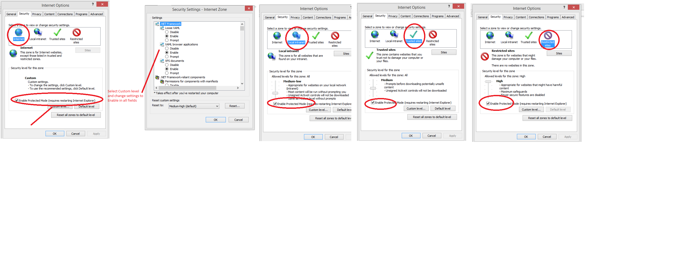

# WebDriver

## Doc
1. Official Doc: http://selenium-python.readthedocs.io/index.html

## Download 

|Browser|Download|
|:-----:|:------:|
|Chrome|https://github.com/SeleniumHQ/selenium/wiki/ChromeDriver|
|Firefox|https://github.com/mozilla/geckodriver/releases|
|Internet Explorer|https://github.com/SeleniumHQ/selenium/wiki/InternetExplorerDriver|
|Selenium-Standalone|https://www.seleniumhq.org/download/|

## Standalone Server

> 

## Trouble Shooting
### Connection to IE browser
Similar errors include:
 * `An existing connection was forcibly closed by the remote host`
 * `Connection Refused`
 * `internet explorer webdriver failed to connect to localhost/0:0:0:0:0:0:0:1:41151`
 * `protected mode settings are not the same for all zones. enable protected mode must be set to the same value (enabled or disabled) for all zones`
 
**Solution**: 
`Enable Protected Mode` for IE and **restart operation system**.

### Firefox no furtuer operation after start
Possibly caused by a mismatch of driver version and Firefox version.
Following combinations are proved to work:

|Browser Ver.|WebDriver Ver.|Selenium Standalone Server Ver.|
|:----------:|:------------:|:-----------------------------:|
|Firefox 53.0.3|v0.18.0|3.11.0|
|IE 11.09600.18920|3.5.1.0|3.11.0|
|Chrome 65.0.3325.162|2.36.540470|3.11.0|

### Chrome missing or invalid 'entry.level' Error
Caused by the version dismatch of google-chrome and chromedriver